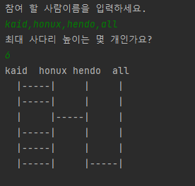
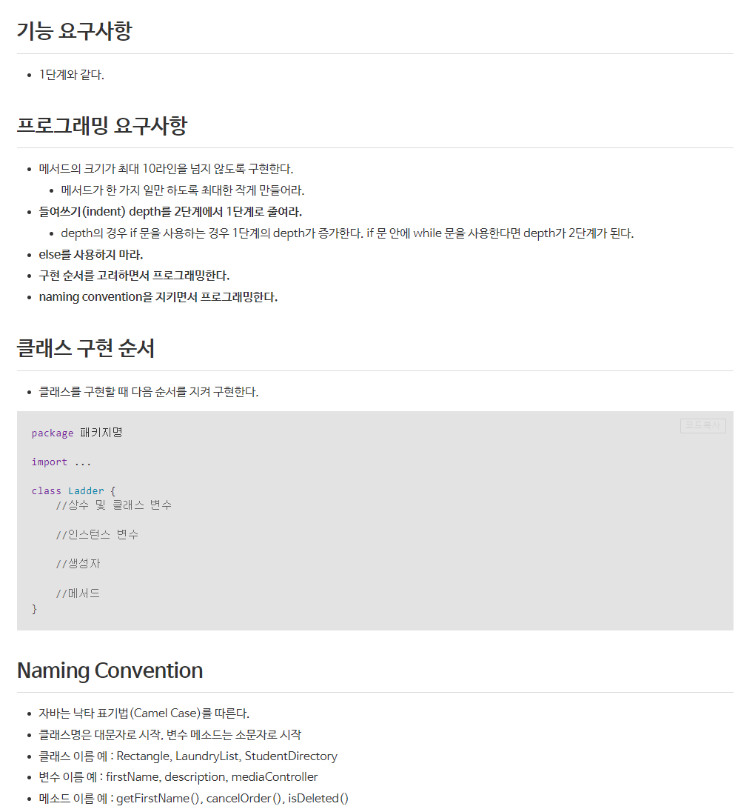
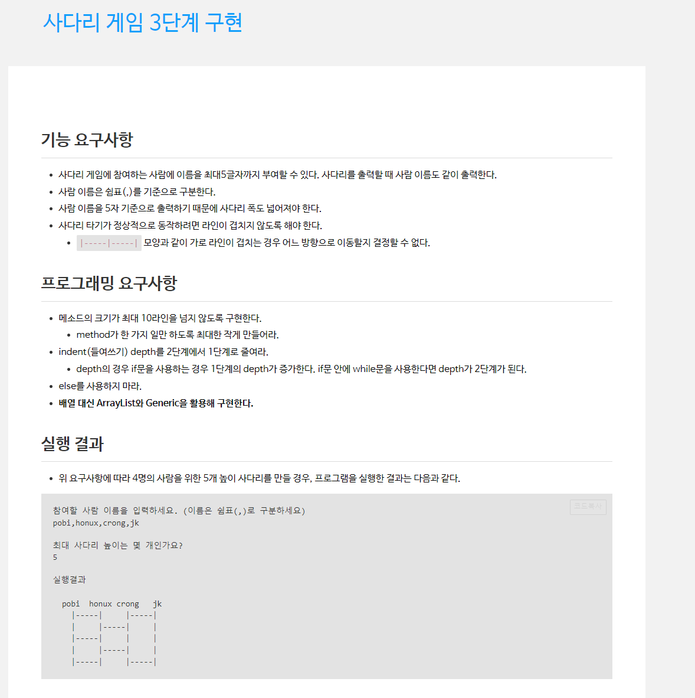

# be-w1-ladder-game

자바 웹 백엔드 1주차 사다리 게임

## 실행 화면

# step2
- ## 요구사항  
  - ### Step 1 PR 피드백
    - Main 에 있는 IO 관련 프로세스를 함수화
    - numOfPeople , height 변수를 final 변수로 변경하고, setter 삭제.
    - 사용되지 않는 메소드 제거.
    - getter,setter 사용 최소화
    - isLadderLine 함수의 인자수 3개->2개로 최소화
  - ### 개선 필요해보이는 부분
    - height -> ladderHeight 로 변수명 변경
    - 각 위치별로 print 하기보다는 String으로 만들어 한 번에 print
  - ### 2단계 요구사항
  - 
    https://lucas.codesquad.kr/2022-kakao/course/%EC%9B%B9%EB%B0%B1%EC%97%94%EB%93%9C/%EC%82%AC%EB%8B%A4%EB%A6%AC-%EA%B2%8C%EC%9E%84/ladder-game-step-2_

- ## 구현 내용 
  - LadderIO class를 생성하여 Main 에서 처리하던 File IO 관련 부분을 처리.
    - Ladder에서 getter, setter 삭제 후, Ladder 생성자로 ladder 객체 생성하도록 변경.
  - indent depth를 줄이고자 2기존의 Ladder를 2차원 Array로 표현하던 구조를 ArrayList 내 class로 변경.
    - ArrayList<Line> 를 이용하여 drawLadder 표현.
    - Line Clss를 만들어, 각 사다리의 높이 별로 각 줄을 생성
  - 매번 print로 각 위치를 출력하는 것을 String 을 사용하여 줄단위로 print 하도록 수정. 
# step3
- ## 요구사항
  - ### Step2 PR 피드백
    - ArrayList 로 타입 선언된 객체를 List형으로 변경
    - Ladder 클래스 내 structure를 final로 설정.
    - gitignore을 통해 .idea, .iml 파일 push 되지 않도록 처리
  - ### 개선 필요해 보이는 부분
  - ### 3단계 요구사항
    - 사람 이름 부여.
    - 사다리의 폭 넓게 생성.
    - ArrayList와 Generic을 활용해 구현.
    - 사다리 라인이 겹치지 않도록 생성.
    - 
    - https://lucas.codesquad.kr/2022-kakao/course/%EC%9B%B9%EB%B0%B1%EC%97%94%EB%93%9C/%EC%82%AC%EB%8B%A4%EB%A6%AC-%EA%B2%8C%EC%9E%84/%EC%82%AC%EB%8B%A4%EB%A6%AC-%EA%B2%8C%EC%9E%84-3%EB%8B%A8%EA%B3%84-%EA%B5%AC%ED%98%84
- ## 구현 내용
  - 사다리의 폭을 넓히기 위해 string.repeat() 함수를 이용.
  - 사람이름을 가장 윗 줄에 추가하기 위한 함수 printHighestLine() 함수 생성.
  - 사람 이름이 사다리의 중앙에 오도록 길이에 맞게 사이 공백의 길이 조절.