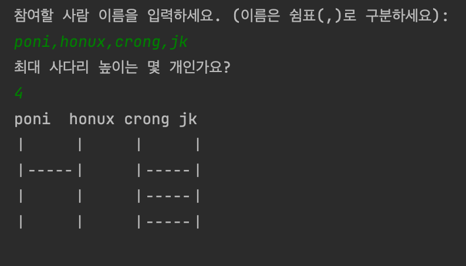

# be-w1-ladder-game

## 자바 웹 백엔드 1주차 사다리 게임
### Step 1(2021.12.27)
#### 고려할 사항
- 앞으로의 주차에 어떤 요구사항이 추가될지 모르므로 확장성을 고려해 설계한다.
- 객체 지향에 집중한다.
#### 요구사항 / 예외처리
- 간단한 사다리 게임을 구현한다. 
- n명의 사람과 m개의 사다리 개수를 입력할 수 있어야 한다.
  - [X] n,m <=0 인 경우 다시 입력 받아야 함
- 사다리의 라인은 랜덤 값에 따라 있거나 없을 수도 있다.
- 사다리가 있으면 -를 표시하고 없으면 "(Space)" (공백문자)를 표시한다.
- 양옆에는 |로 세로를 표시한다.
  - [X] 한글 모음 "ㅣ"로 사용 
- 사다리 상태를 화면에 출력한다. 어느 시점에 출력할 것인지에 대한 제약은 없다.
  - [X] 코드의 마지막에 출력
- [X] -ㅣ-  의 경우는 존재 불가 (어디를 타야할 지 모르기 때문)
#### 실행 결과
 

### Step 2(2021.12.28)
#### 요구사항
- [X] 메서드의 크기가 최대 10라인을 넘지 않도록 구현한다.
- [X] 메서드가 한 가지 일만 하도록 최대한 작게 만들어라.
- [X] 들여쓰기(indent) depth를 2단계에서 1단계로 줄여라.
  - depth의 경우 if 문을 사용하는 경우 1단계의 depth가 증가한다.
- if 문 안에 while 문을 사용한다면 depth가 2단계가 된다.
- [X] else를 사용하지 마라.
- 구현 순서를 고려하면서 프로그래밍한다.
- naming convention을 지키면서 프로그래밍한다.
  - 자바는 낙타 표기법(Camel Case)를 따른다.
  - [X] 클래스명은 대문자로 시작, 변수 메소드는 소문자로 시작
  - 클래스 이름 예 : Rectangle, LaundryList, StudentDirectory
  - 변수 이름 예 : firstName, description, mediaController
  - 메소드 이름 예 : getFirstName(), cancelOrder(), isDeleted()

### Step 3(2021.12.29)
#### 요구사항
- 사다리 게임에 참여하는 사람에 이름을 최대5글자까지 부여할 수 있다.
- 사다리를 출력할 때 사람 이름도 같이 출력한다.
- 사람 이름은 쉼표(,)를 기준으로 구분한다.
- 사람 이름을 5자 기준으로 출력하기 때문에 사다리 폭도 넓어져야 한다.
- 사다리 타기가 정상적으로 동작하려면 라인이 겹치지 않도록 해야 한다.
- |-----|-----| 모양과 같이 가로 라인이 겹치는 경우 어느 방향으로 이동할지 결정할 수 없다.

#### 실행 결과
 

### Step 4(2021.12.30)
#### 요구사항
- 로직을 구현하는 코드에 단위 테스트가 존재해야 한다. 단, UI 처리 로직(System.in, System.out)은 테스트에서 제외한다.
- 각각의 역할에 맞도록 패키지를 분리하고 접근 제어자를 적절히 사용하도록 리팩토링한다.
- Line 객체에서 선을 그릴 수 있는지 여부를 판단하는 로직에 대한 단위 테스트를 반드시 추가한다.
- 사다리 결과를 출력할 때 최대 5 글자를 정확히 출력하는지 처리하는 로직에 대한 테스트를 추가한다.